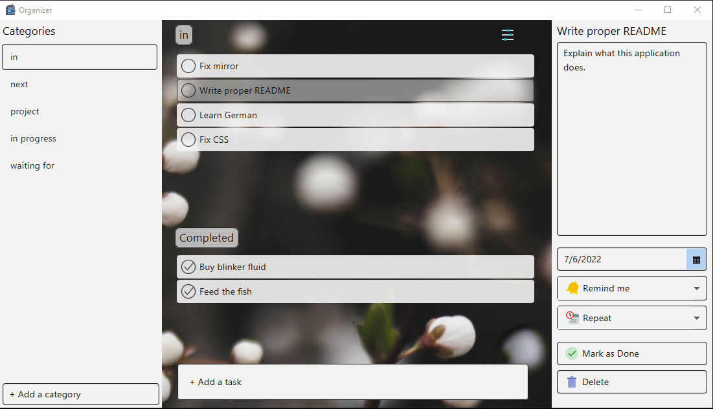
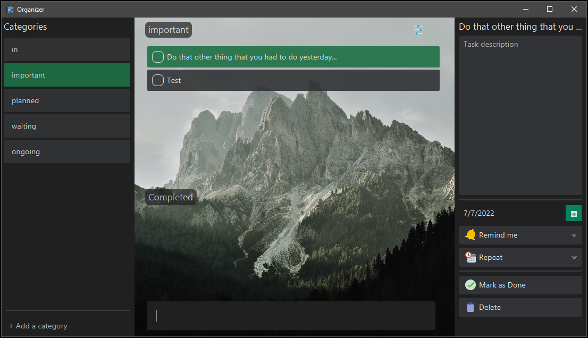

# Organizer

## Summary

This is basically a application that tries to marry concept of TODO app and a GTD philosophy, and it's ~~a cheeky rip-off~~ heavily inspired by 
Microsoft's [TO DO app](https://todo.microsoft.com/tasks/). 

I wrote it because I wanted an oldschool, simple desktop organizer application without accounts and all that online non-sense, and also it gave me a opportunity to try out pro tips form Robert Martin's book 'Clean Code', and learn JavaFX. Of course code's still a complete mess and GUI looks cheap at best, 
but I did my best and I see a progress! 

Everything's a WIP, so expect things to break, but overall it works surprisingly stable. 
## Features

- Cross platform: supports Windows and Linux
- Create tasks & thier description 
- Create custom categories 
- Add reminders 
- Switch between dark and light theme
- Set backgrounds
- And more!
  
## Screenshots

  

## Authors

- [@Banogrono](https://github.com/Banogrono)

  
